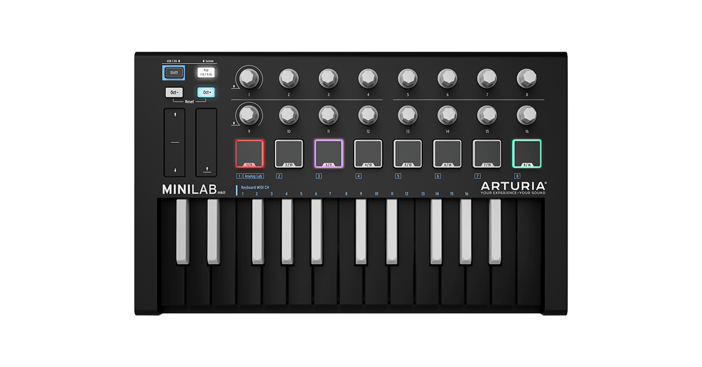
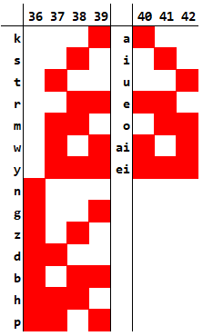

# Klatt Voice Synthesizer for STM Microcontroller

This is an implementation of a Klatt synthesizer as described in [this paper](http://www.fon.hum.uva.nl/david/ma_ssp/doc/Klatt-1980-JAS000971.pdf). This was completed as part of a course in music programming, and the base code was taken from its [course website](http://synthnotes.ucsd.edu/wp4/). A prototype of this project I made in Pure Data can be found [here](https://github.com/Origamijr/Klatt-Synth-PD).

There are two simple approaches to speech synthesis. The first one is concatenative synthesis, where a large corpus of phoneme samples are collected and concatenated together to form speech. The problem with this approach is that it would require much more memory to store all the audio samples than a simple microcontroller can hold. As such, I elected for using formant synthesis, where a single waveform is passed through multiple filters corresponding to various formants in order to model the vocal track.

# Table of Contents
* [Usage](#Usage)
    * [Setup](#Setup)
    * [Controls](#Controls)
    * [Polyphony Mode and Formant Synth Mode](#Polyphony-Mode-and-Formant-Synth-Mode)
* [Technical Details](#Technical-Details)
    * [Signal Interpolation](#Signal-Interpolation)
    * [Waveform Sources](#Waveform-Sources)
    * [Filters](#Filters)
    * [Parallel/Cascading Filters](#Parallel/Cascading-Filters)
    * [Delaying Parameter Changes](#Delaying-Parameter-Changes)
    * [Phoneme Input to Parameters](#Phoneme-Input-to-Parameters)
* [Notes](#Notes)

# Usage

## Setup
This project was written and built in the [STM32CubeIDE](https://www.st.com/en/development-tools/stm32cubeide.html) for the STMF4 Discovery Kit.

While this program can be compatible with any MIDI controller, it was written with the default configuration of the [Arturia Minilab mkii](https://www.arturia.com/products/hybrid-synths/minilab-mkii/overview) in mind (especially the layout of the drum pads).

## Controls

The controls for each of the knobs are shown below.

Knob | MIDI Ctrl # | Function | Polyphony Mode | Formant Synth Mode
---|---|---|---|---
Pitch Bend | | Pitch Bend | x | x
Modulation | 1 | Flutter Depth | | x
10 | 18 | Master Volume | x | x
11 | 19 | Interpolation Length | | x
12 | 16 | Sine-Pulse Interpolation | x | x
2 | 74 | Resonator Frequency | x |
3 | 71 | Resonator Bandwidth | x |
4 | 76 | Resonator Wetness | x |
5 | 77 | Antiresonator Frequency | x |
6 | 93 | Antiresonator Bandwidth | x |
7 | 73 | Antiresonator Wetness | x |

Users can toggle between polyphony mode and formant synth mode by pressing the blue button on the STM board. The software starts in polyphony mode by default.

In formant synth mode, MIDI keys 36-43 are used to select consonant and vowel phonemes. On the minilab, these notes correspond to the drumpads above the keys. Notes 36-42 are used to select which consonants and vowels are to be played, and note 43 is used to enqueue the current input to be played when a MIDI note above 43 is played. The table below shows how the inputs for notes 36-42 decode into the set consonant-vowel pairs.

## Polyphony Mode and Formant Synth Mode

Polyphony mode acts like a normal synthesizer with some controls on the timbre of the tone. This mode supports 16 note polyphony with the envelope of each note controlled by a simple attack, sustain, release envelope. Resonator (Bandpass) and antiresonator control is support through the use of control knobs.

Formant synth mode models the vocal tract with the use of many filters acting on an aperiodic source (white noise) and a periodic source (Pulse-like waveform whose fundamental frequency is the running average of active notes). Playing a note dequeues an enqueued CV and plays the phonemes through the corresponding formant parameters.

# Technical Details

A good portion of the code to obtain base functionality (MIDI control and audio output) came from the course insructor [here](http://synthnotes.ucsd.edu/wp4/), so I will discuss a subset of code relavent to formant synthesis here instead. There is more code I modified, but these portions discussed here are the most relevant portions for the core functionality.

## Signal Interpolation

Since there are many parameters to be controlled in a vocal track model (around 30), I needed a vesatile system to smoothly change multiple parameters at once. To achieve this, I utilized a stuct for each parameter structured as follows:

    typedef struct signalInterp {
        float value;
        float duration;
        float t;
        float delta;
        int resting;
    } signalInterp;

Each stuct contains the current value of the parameter, the duration the value should be interpolated over, the current point in time of the interpolation (since different interpolations can occur at different times), a delta value to store how much to change the value by each time step, and a resting variable to determine if the parameter is currently changing.

When a parameter is notified to change, the delta value is updated based on the deifference between the current value and the target value, and the total duration of the interpolation. 

    interp->delta = (value - interp->value) / interp->duration * DELTA_TIME;

When computing audio, the delta is applied until the time interpolated exceeds the preset duration. Some parameters are not computed at every sample (i.e., frequency and bandwidth) since updating those parameters would require a full computation of the filter coefficients every sample, so I chose to interpolate those parameters every audio block instead without a noticeable change in audio quality.

    for (j = 0; j < NUM_FORMANT_PARAM; j++) {
        if (!formantParams[j].resting) {
            formantParams[j].resting = formantParams[j].t > formantParams[j].duration;
            if (!formantParams[j].resting) {
                if (j <= F0) {
                    // Per sample param change
                    formantParams[j].value += formantParams[j].delta;
                    formantParams[j].t += DELTA_TIME;
                } else if (i == 0){
                    // Batch param change (for center frequency and bandwidth)
                    formantParams[j].value += samples * formantParams[j].delta;
                    formantParams[j].t += samples * DELTA_TIME;
                }
            }
        }
    }

## Waveform Sources

The base code provides an array of size 4096 to sample values from a sin wave from. To calculate the source for the periodic source, the fundamental frequency, F0, is treated as an interpolated parameter (since singing is monophonic, and there can be smooth transitions between pitches) in the MIDI domain. This F0 is used to extract two values from a MIDI to frequency table (also provided in the base code) to interpolate the fundamental frequency, and multiplied by a pitch bend scalar (also in the base code) as follows

    midiPitch = (int)formantParams[F0].value;
    midiMix = formantParams[F0].value - midiPitch;
    frequency = ((1.0f - midiMix) * mtoinc[midiPitch] + midiMix * mtoinc[midiPitch + 1]) * pitchbend1024[pitchbend >> 4];

In Klatt's original paper, he makes use of a "flutter", which is a quasirandom fluctuation to the fundamental frequency simulated by the sum of three low frequency sine waves. I control the depth of this fluctuation through a control knob. The utilized equation for flutter is shown below

    frequency += flutter * frequency * 0.01f * (sinTable(flutterp1) + sinTable(flutterp2) + sinTable(flutterp3));

The frequency is then applied to the phase and an output from the sine function is obtained.

    runningVoicePhase += frequency;
    if (runningVoicePhase > 1.0f) runningVoicePhase = runningVoicePhase - 1.0f;
    sig = sinTable(runningVoicePhase);

Finally, to obtain a more pulse-like waveform approximating the glottal vocal source, a ReLU waveshapping is applied to the sine as follows

    sig = (sig > waveshapper) ? (sig - waveshapper) / (1.0f - waveshapper) : 0.0f;

To obtain the aperiodic source, a cheap random float function is used to obtain a pseudorandom number between -1 and 1 ever sample.

    float randf() {
        randStruct.next = (randStruct.next * 196314165) + 907633515;
        return (float)randStruct.next * 0.0000000004656612873077392578125f - 1.0f;
    }

## Filters
There are two types of filters used: resonators and antiresonators. Equations for both filters are from Klatt's paper. Both resonators utilize the same underlying struct shown below

    typedef struct resonator {
        float out1;
        float out2;
        float a;
        float b;
        float c;
        float f;
        float bw;
    } resonator;

There are two different functions that modify the resonator struct shown below

    float resonatorSamp(resonator* r, float in, float frequency, float bandwidth) {
        float out, e;
        if (frequency != r->f || bandwidth != r->bw) {
            r->f = frequency;
            r->bw = bandwidth;
            e = expf_fast(-bandwidth * PI_DT);
            r->c = -e * e;
            r->b = 2.0f * e * sinTable(2.0f * DELTA_TIME * frequency + 0.75f);
            r->a = 1.0f - r->c - r->b;
        }
        out = in * r->a + r->b * r->out1 + r->c * r->out2;
        r->out2 = r->out1;
        r->out1 = out;
        return out;
    }
    float antiresonatorSamp(resonator* r, float in, float frequency, float bandwidth) {
        float out, e;
        if (frequency != r->f || bandwidth != r->bw) {
            r->f = frequency;
            r->bw = bandwidth;
            e = expf_fast(-bandwidth * PI_DT);
            r->c = -e * e;
            r->b = 2.0f * e * sinTable(2.0f * DELTA_TIME * frequency + 0.75f);
            r->a = 1.0f / (1.0f - r->c - r->b);
        }
        out = (in - r->b * r->out1 - r->c * r->out2) * r->a;
        r->out2 = r->out1;
        r->out1 = in;
        return out;
    }

The main difference between the two is that the first coefficient is calculated differently, the other terms are subtracted rather than added, and the input is propagated in the antiresonator rather than the output. Functionally, the antiresonator "undoes" the additions done by the resonator. The coefficients are only recalculated when the frequency and bandwidth changes, since each recalculation utilizes about 10 multiplications, and the antiresonator uses one division.

## Parallel/Cascading Filters

The full vocal track model is essentially linking many filters together with amplitude controls in certain locations. The code is shown below.

    // Amplitude envelope application and preliminary filtering
    sig = resonatorSamp(&resonators[RGP], sig, 0.0f, 200.0f);
    sig = formantParams[AV].value * antiresonatorSamp(&resonators[RGZ], sig, 1500.0f, 6000.0f) +
            formantParams[AVS].value * resonatorSamp(&resonators[RGS], sig, 0.0f, 200.0f);

    // Noise source
    noise = resonatorSamp(&resonators[LPF], randf(), 0.0f, 1000.0f);

    // Track splitting
    sigc = formantParams[AH].value * noise + sig;
    noise = formantParams[AF].value * noise;

    // Cascade track
    sigc = resonatorSamp(&resonators[RNP], sigc, 270.0f, 50.0f);
    sigc = antiresonatorSamp(&resonators[RNZ], sigc, formantParams[FNZ].value, 50.0f);
    sigc = resonatorSamp(&resonators[RC1], sigc, formantParams[F1].value, formantParams[B1].value);
    sigc = resonatorSamp(&resonators[RC2], sigc, formantParams[F2].value, formantParams[B2].value);
    sigc = resonatorSamp(&resonators[RC3], sigc, formantParams[F3].value, formantParams[B3].value);
    sigc = resonatorSamp(&resonators[RC4], sigc, 3300.0f, 250.0f);
    sigc = resonatorSamp(&resonators[RC5], sigc, 3750.0f, 200.0f);

    // Parallel track
    sigp = 0.0f;
    sigp += formantParams[A2].value * resonatorSamp(&resonators[RP2], noise, formantParams[F2].value, formantParams[B2].value);
    sigp += formantParams[A3].value * resonatorSamp(&resonators[RP3], noise, formantParams[F3].value, formantParams[B3].value);
    sigp += formantParams[A4].value * resonatorSamp(&resonators[RP4], noise, 3300.0f, 250.0f);
    sigp += formantParams[A5].value * resonatorSamp(&resonators[RP5], noise, 3750.0f, 200.0f);
    sigp += formantParams[A6].value * resonatorSamp(&resonators[RP6], noise, 4900.0f, 1000.0f);
    sigp += formantParams[AB].value * noise;

    // Recombination and velocity application
    out = (sigp + sigc) * formantParams[A0].value * 0.0078125f * masterVolume;

The periodic source is first sent through a low pass filter (resonator with center frequency 0), then passed through a resonator and an antiresonator in parallel. The aperiodic source is also passed through a low pass filter. The filtered periodic and aperiodic sources are combined and sent to the cascading track, which consists of five resonators. The aperiodic source is sent to the parallel track which consists of 5 filters and a bypass path. The outputs of the parallel and cascading track are then combined to form the output.

## Delaying Parameter Changes

A single CV phoneme consists of many parameter changes that occur at different times. In order to handle this, I created a priority queue that enables inputs to schedule parameter changes. The priority queue holds the struct shown below.

    typedef struct delayedInterp {
        float start;
        float value;
        float duration;
        formantParam param;
    } delayedInterp;

Each value in the queue contains a start time, a value to change to, how long the interpolation should last, and the parameter to be interpolated. The priority queue is stored as a fixed sized sorted array, and is mainly modified by the three functions below.

    void enqueueDelInterp(formantParam param, float delay, float value, float duration) {
        int curr, prior;
        delQueueRear = (delQueueRear + 1) % DEL_QUEUE_CAP;
        curr = delQueueRear;
        prior = curr == 0 ? DEL_QUEUE_CAP - 1 : curr - 1;
        while (curr != delQueueFront && delay < delQueue[prior].start) {
            delQueue[curr] = delQueue[prior];
            curr = prior;
            prior = curr == 0 ? DEL_QUEUE_CAP - 1 : curr - 1;
        }
        delayedInterp di = {delay, value, duration, param};
        delQueue[curr] = di;
        delQueueSize++;
    }
    delayedInterp dequeueDelInterp() {
        delayedInterp di = delQueue[delQueueFront];
        delQueueFront = (delQueueFront == DEL_QUEUE_CAP - 1) ? 0 : delQueueFront + 1;
        delQueueSize--;
        return di;
    }
    void emptyDelInterp() {
        delQueueFront = (delQueueRear == DEL_QUEUE_CAP - 1) ? 0 : delQueueRear + 1;
        delQueueSize = 0;
        delTime = 0.0f;
    }

When structs are enqueued, they are inserted into the array in sorted order so that the front of the queue always contains the earliest delayed value. At each stop of the audio block, the front of the queue is checked, and if the start time is greater than or equal to the current time, then the parameter is set to interpolate as shown below.

    while (delQueueSize > 0 && delQueue[delQueueFront].start < delTime) {
        delayedInterp di = dequeueDelInterp();
        interp(&formantParams[di.param], di.value, di.duration);
    }
    delTime += DELTA_TIME;

## Phoneme Input to Parameters

Whenever a MIDI note between 36 and 42 is pressed (drumpads on the minilab), a corresponding bit is flipped on a global variable as shown below.

    cvKeyboard ^= 1 << (42 - pack.evnt1);

When a MIDI note 43 is pressed, the value in the global variable is stored in a FIFO queue and the global variable is reset so another input can be entered.

    cvQueueRear = (cvQueueRear == CV_QUEUE_CAP - 1) ? 0 : cvQueueRear + 1;
    cvQueue[cvQueueRear] = cvKeyboard;
    cvKeyboard = 0;
    cvQueueSize++;

When a MIDI note is played and the queue is not empty, a CV is dequeued and passed through two case statements as shown below.

    currCV = cvQueue[cvQueueFront];
    if (cvQueueSize > 0) {
        cvQueueFront = (cvQueueFront + 1) % CV_QUEUE_CAP;
        cvQueueSize--;
    } else {
        currCV = cvQueue[(cvQueueFront ? cvQueueFront : CV_QUEUE_CAP) - 1];
    }
    vowelDelay = 0.0f;
    vowelTransition = -1.0f;
    emptyDelInterp();
    switch ((currCV & 0x78) >> 3) {
        ...
    }
    lastVowel = ((currCV & 0x7) == CODE_REP) ? lastVowel : (currCV & 0x7);
    switch (lastVowel) {
        ...
    }

Each case contains multiple function calls to enqueue delayed changes to parameters for the vocal track model. The parameters are taken from a table in the paper by Klatt. An axample for a consonant is shown below.

    case CODE_G:
        // Stop
        enqueueDelInterp(AV, 0.0, 0.0, 0.015);
        enqueueDelInterp(AVS, 0.0, 0.0, 0.015);

        setFormantTransitions(0.0f);
        enqueueDelInterp(F1, 0.02f, 200.0f, -1.0f);
        enqueueDelInterp(F2, 0.02f, 1990.0f, -1.0f);
        enqueueDelInterp(F3, 0.02f, 2850.0f, -1.0f);
        enqueueDelInterp(B1, 0.02f, 60.0f, -1.0f);
        enqueueDelInterp(B2, 0.02f, 150.0f, -1.0f);
        enqueueDelInterp(B3, 0.02f, 280.0f, -1.0f);

        // Burst
        enqueueDelInterp(A3, 0.0f, 0.5f, 0.0f);
        enqueueDelInterp(A4, 0.0f, 0.125f, 0.0f);
        enqueueDelInterp(A5, 0.0f, 0.15f, 0.0f);
        enqueueDelInterp(AB, 0.0f, 0.15f, 0.0f);
        enqueueDelInterp(AF, 0.05f, 0.05f, 0.001f);
        enqueueDelInterp(AF, 0.051f, 0.0f, 0.01f);
        enqueueDelInterp(A3, 0.1f, 0.0f, 0.0f);
        enqueueDelInterp(A4, 0.1f, 0.0f, 0.0f);
        enqueueDelInterp(A5, 0.1f, 0.0f, 0.0f);
        enqueueDelInterp(AB, 0.1f, 0.0f, 0.0f);

        // Aspiration
        enqueueDelInterp(AH, 0.05f, 0.01f, 0.025f);
        enqueueDelInterp(AH, 0.075f, 0.0f, 0.1f);

        // Voicing
        vowelDelay = 0.1f;
        vowelTransition = 0.1f;
        enqueueDelInterp(AV, 0.1, 1.0, 0.05f);
        enqueueDelInterp(AVS, 0.1, 1.0, 0.05f);
        break;

# Notes

The current parameters for some consonant and vowels can use more work. In particular, the delay times and interpolation durations for the plosives (k, t, p, g, d, b) and fricatives (s, z) can be better. As they are now, they barely resemble the sound they are supposed to represent.